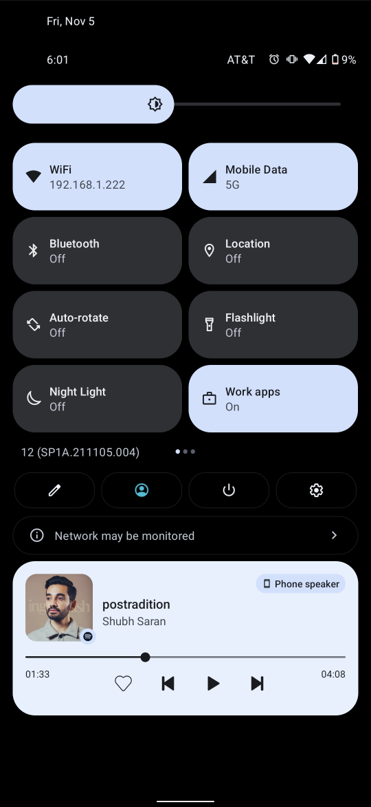

# Cytokinesis
Divide your "Internet" QuickSettings tile back into two tiles!

## About

This app provides two separate QuickSettings toggles for Android 12+ that can somewhat-more-directly allow the user to toggle Wifi and Mobile Data enablement independently.
  
The term "cytokinesis" describes one of the last steps in the eukaryotic cell division process which divides the cytoplasm into two distinct cells.  
  
Seemed fitting.

## Screenshot

The tiles look like this:  
  

  

## Motivation

With the release of Android 12 (S) for Pixel devices, a certain increasingly "evil" big G decided that the thing users _really_ needed was UI refresh.  
One minor facet of that involved combining the WiFi and Mobile Data QuickSettings toggles.  
  
Absurdly enough, the stated reasoning for this is that apparently:
* Some users will disable one or the other and forget to re-enable it later
* This change and associated additional taps somehow make it easier to accomplish what these users wanted
* Their studies (which were not disclosed) purportedly prove that users "prefer" this change
  
One can see how the additional taps involved might have the opposite effect - annoying users into leaving everything connected (for ad data collection) all the time.  
Anyway, I was mildly annoyed with this decision and its strange self-blindness, so as an exercise in futility I decided to take on the giant and undo this one super tiny change.  
  
Thus, this project was born.  

## Related reading

- Silly, backward reasoning provided by a certain someone about a certain something:  
  https://support.google.com/pixelphone/thread/132446941/behind-the-scenes-looks-at-the-new-internet-tile
- Example of reverting using ADB (sadly, killed w/ November 2021 update) by Twitter user `@MishaalRahman`:  
  https://twitter.com/MishaalRahman/status/1452868924152983552
  
## Support

Please don't expect any.
  
I'm just an average guy who serves as an average hero.  

  
That said, PRs are welcome.  
However, if you must open an issue, please include information such as:
- Your device model
- Android version
- Patch/update level
- Firmware/ROM type (e.g. GrapheneOS, vanilla AOSP, LineageOS, etc.)
- Logs/traces if you know where to find them
- Screenshots if the UI is involved
- etc.

  
**Enjoy!**

## Project TODO
- Add ability to change tile titles
- Finish finding/creating the required icons
  - Normal "arrows"-type data icon when connected
  - "IWLAN" ?
- Find a way to fix the stuttering?
    - Try to actually catch DISCONNECTED events?
    - WifiManager seems to have `isWifiConnected` or something
- Consider developing a root alternative?
